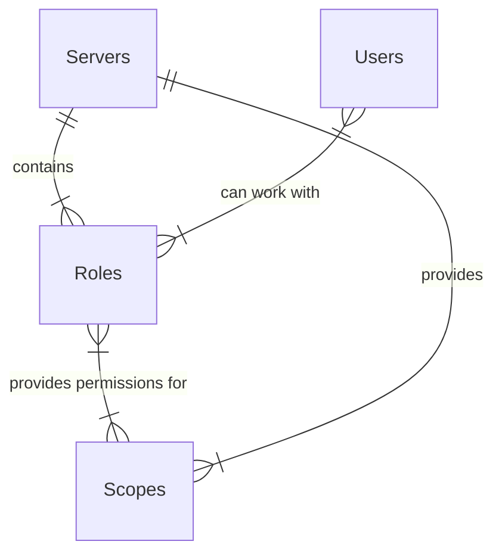
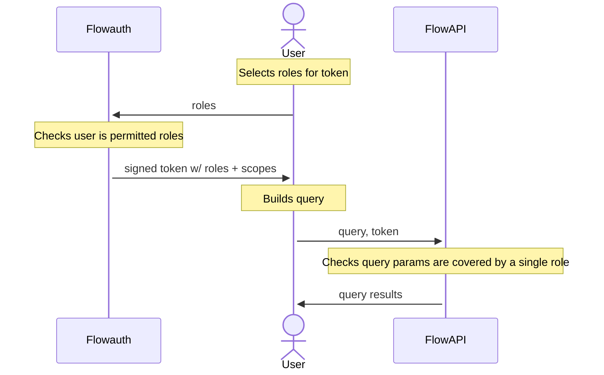

# Rework of permissions system

2022/12/16

**Status**

Accepted

**Context**

When a user passes their query to a Flowmachine instance, they first sign into a Flowauth instance. Within a Flowauth instance, a user has a set of claims that define what combination of queries can be run.
The space for these scopes was generated by a full tree walk of every combination of a query, its geographic components, and all sub-queries (and their geographic components) - though normally derived through targetted traversal of the query tree, there were places where a full walk was required. This offered a very fine degree of control over what queries you could permit users to run, but as the available set of queries increased this space expanded exponentially, eventually becoming unwieldy.
This manifested in several places:
 - When building the API spec inside flowAPI
 - When displaying the spec on the Flowauth frontend for servers (leading to timeouts and crashes on some lower-capability machines)
 - When passing large or specific scopes around as JWTs

**Decision**

The core of the change that has been implemented is to change the definition of what a user can access. Instead of a combination of queries, users are now assigned `roles`, which are composed of `scopes`. A scope can be one of two types;
 - *Simple scopes*

   These control access to a server-wide capability and are all-or-nothing. The currently implemented simple scopes are:
   - `run`; permits a user that holds this role to run queries using the `run` flowAPI endpoint
   - `get_result`; permits a user to get the results of a query using the `get` flowAPI endpoint
   - `get_available_dates`; permits a user to get the list of dates available to run queries against on a server.
   
   These scopes do *not* imply that a role provided the capabilites to run a query by themselves - they must be provided in combination with one or more complex scopes.

 - *Complex scopes*
  
   These control access to a combination of a geographic component, a top-level query and a descendent query.
   - Top-level queries are the methods that are available to the users of Flowmachine directly.
   - Each top-level query may require a set of sub-queries to run, wich in turn may require sub-queries of their own; these are the descendent queries.
   - Finally, the geographic component is the spatial presentation that is available to the role. Queries without spatial aggregates (such as `historgram_aggregate`) have the geographic component `nonspatial`.
   
   Complex scopes are of the form `geographic_component:top_level_query:sub_query` - this ordering has been built on assumed order of importance to users. For example it will be a more common use case that an administrator will want to create a role that restrics access only to admin levels 0 or 1 than to the `most_frequest_location` sub-query of the `spatial_aggregate` top-level query.

As a consequence of this, the new Flowauth db schema is shown below:

And the new auth flow is as follows:

**Consequences**
 - Much faster and more lightweight building of tokens
 - Flowauth frontend can now be used on lower-capability machines
 - Less fine-grained control over query permissions
    - This does have the knock-on effect of reducing the decision space to a more managable size,perhaps leading users to make meaningful decisions about scopes within a role instead of defaulting to 'all'.
 - Users can't be explicitly grouped anymore (roles supercede group functions)
 - Scopes cannot be assigned directly to users anymore.
