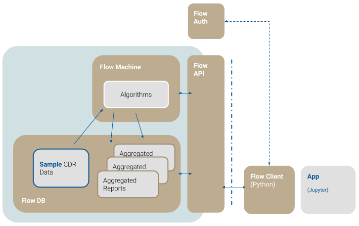

# FlowKit CDR Analytics Toolkit

## What is FlowKit ?

Use FlowKit to analyze the [Call Detail Record](https://en.wikipedia.org/wiki/Call_detail_record) (CDR) data created by mobile network operators (MNOs). CDR data is primarily used for generating subscriber bills and settling accounts with other carriers.  

FlowKit is designed to extend CDR data analysis to meet many other applications beyond billing. Some examples include [disaster response](http://www.flowminder.org/practice-areas/disaster-response), [precision epidimiology](http://www.flowminder.org/practice-areas/precision-epidemiology) and [transport and mobility](http://www.flowminder.org/publications/a-trip-to-work-estimation-of-origin-and-destination-of-commuting-patterns-in-the-main-metropolitan-regions-of-haiti-using-cdr), more examples can be found [here](http://www.flowminder.org/work/research-innovation).
 
CDRs constitute a highly sensitive data set, so FlowKit is designed with privacy protection in mind. It includes the FlowAuth framework to enable fine grained authorization with extensive access logging, making it an important tool for deployment of a GDPR compliant CDR analysis system.  

## How does FlowKit work ?

FlowKit is deployed as a collection of Docker containers on a compute instance, usually hosted inside an MNO firewall. 

Good practice is to pseudonymize CDR data in the first instance. It must then be transposed into the FlowDB standard schema. Once ingested, the user can analyse the records using the example FlowClient included. FlowClient is an example client implemented as a JupyterLab + Python Data Science Stack Notebook. Other client implementations (e.g. R) can be built on the provided FlowAPI.

This architecture is shown in the figure below.

- FlowDB

    A [PostgreSQL](https://www.postgresql.org) database for storing and serving mobile operator data. Initialised with sample data for demonstration purposes. In a live installation, this data comes from the MNO.
    

- FlowMachine

    A Python toolkit for the analysis of CDR data.
    

    
- FlowAPI

    An HTTP API which provides access to the functionality of FlowMachine, and handles access control.
    

    
- FlowClient

    A Python client to FlowAPI.
    

    
- FlowAuth

    An authentication management system used to generate access tokens for use with FlowClient.
    
    

* Redis

    A further container is created to host a redis message platform used internally by FlowMachine.  

FlowKit is in active development, visit the project's  [roadmap](developer/roadmap) to get a sense about upcoming developments.

Continue to the FlowKit [installation documents](./install.md) to find out what type of install meets your requirements.

These documents are also hosted on [https://flowminder.github.io/FlowKit/](https://flowminder.github.io/FlowKit).

## Feature Requests

Please send us your ideas on how to improve FlowKit to [flowkit@flowminder.org](mailto:flowkit@flowminder.org).
Or add requests here: [Feature Requests](https://github.com/Flowminder/FlowKit/issues).

